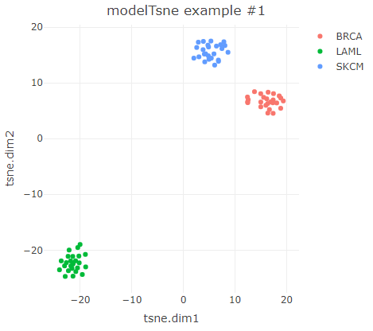
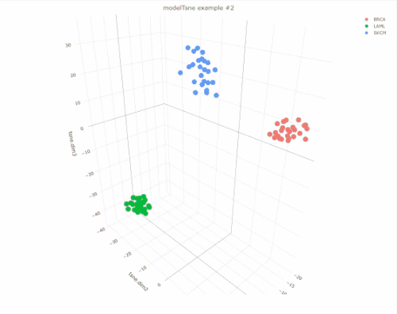
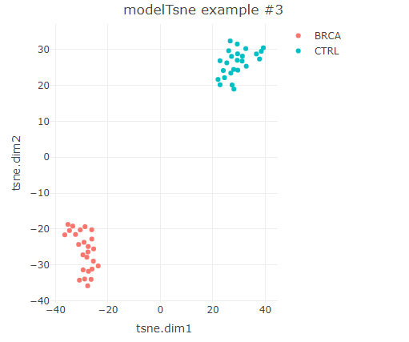
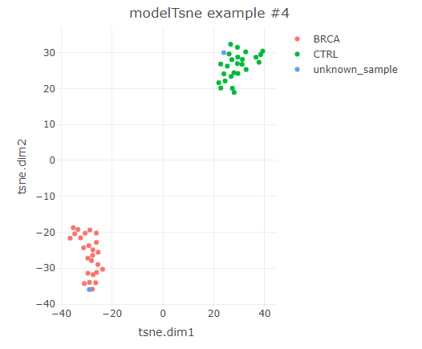

# modelTsne
The R package modelTsne provides functions to perform variable selection, t-SNE dimensional reduction analysis, 
generation and use of persistent t-SNE reference frameworks, and also, plot generation.


## Package Installation

```r
library(remotes)
install_github("oicr-gsi/modelTsne")
```

## Overview of a typical workflow

#### Data preparation:
  1) **Build data frame**, where columns correspond to samples and rows to variables.
  2) **Variable selection:** the function `variableSelection(data=..., method=...)` returns the 'n' most informative variables in terms of high dispersion (IQR and SD) or discriminating power (ANOVA and logistic).
  
#### Exploratory t-SNE analysis
  3) **Dimensional reduction with t-SNE:** `modelTsne(data=..., perplexity=..., persistent=FALSE)` performs t-SNE analysis and returns an 'ephemeral' model.
  4) **Plot t-SNE configuration** using the function `plotTsne(model=..., method=...)` to produce dynamic plots (`method=plotly`) or static plots (`method=ggplot`). 

#### Construction and use of persistent t-SNE reference frameworks (optional)
  5) **Build a persistent t-SNE model:** the function `modelTsne(data=..., perplexity=..., persistent=TRUE)` performs t-SNE analysis and returns a persistent `modelTsne` object.
  6) **New sample analysis:** the function `doTsneWithReference(data=...,model=...)` is used to project data from new samples into the pre-existing t-SNE configuration of a persistent `modelTsne` object, and produces a new t-SNE configuration that contains both the original and the new samples.
  7) **Plot the resulting t-SNE configuration** using the function `plotTsne(model=..., method=...)`

## Examples

We will use modelTsne to visualize DNA methylation data (M-values) from the TCGA project. The data frames `meth_IQR1000`, `meth_ANOVA1000` and `meth_unknown` that are included in the package contain example data.

In the first example, the function `selectVariables()` is used to select the 500 most informative variables using the IQR method (prioritizes variables with high dispersion). Then, t-SNE analysis is performed by using `modelTsne()`, where the `perplexity` parameter is mandatory (typical values 5-50, results vary greatly from one dataset to another), and the optional parameter `group` will be part of the resulting `modelTsne` object and used during plotting but it does not influence t-SNE analysis. Finally, a plot of the resulting t-SNE configuration is generated with `plotTsne()`.
```
library(modelTsne)
meth<-selectVariables(data=meth_IQR1000, method="IQR", no.variables=500)
group<-c(rep("BRCA",25),rep("LAML",25),rep("SKCM",25))
tsne<-modelTsne(data=meth, perplexity=12, group=group)
plotTsne(model=tsne, method="plotly", title="modelTsne example #1")
```


The number of dimensions of the t-SNE analysis can be specified by the `dims` parameter of `modelTsne()`. The function `plotTsne()` can handle 1-, 2- and 3-dimensional configurations (3 dimensions with `plotTsne(...,method=plotly)` only).
```
tsne<-modelTsne(data=meth, perplexity=12, group=group, dims=3)
plotTsne(model=tsne, method="plotly", title="modelTsne example #2")
```


To perform group-dependent variable selection, the `selectVariables()` function implements the ANOVA and logistic methods (prioritizes samples with lowest p-values). This approach is useful when SD and IQR approaches do no separate the groups of interest satisfactorily, which can be caused by the pressence in the dataset of a dominant trend that interferes or masks entirely the groups of interest. 
```
group<-c(rep("BRCA",25),rep("CTRL",25))
meth<-selectVariables(data=meth_ANOVA1000, method="ANOVA", no.variables=500, group=group, threads=8)
tsne<-modelTsne(meth, perplexity=8, group=group)
plotTsne(tsne, method="plotly", title="modelTsne example #3")
```


A persistent t-SNE reference framework allows 'injecting' new data into a pre-existing dimensional reduction analysis. One application of this methodology is to provide a visual perspective of a classification problem without having to deal with 'shifting' reference configurations; modelTsne can be a powerful complement for a classifier but not a replacement.
```
tsne.persistent<-modelTsne(meth, perplexity=8, group=group, persistent=TRUE)
tsne<-doTsneWithReference(data=meth_unknown, model=tsne.persistent)
plotTsne(tsne, method="plotly", title="modelTsne example #4")
```



## Credits

Developed by Alberto León at [Ontario Institute for Cancer Research / Genome Sequence Informatics team](https://oicr.on.ca/)

[](https://oicr.on.ca)


